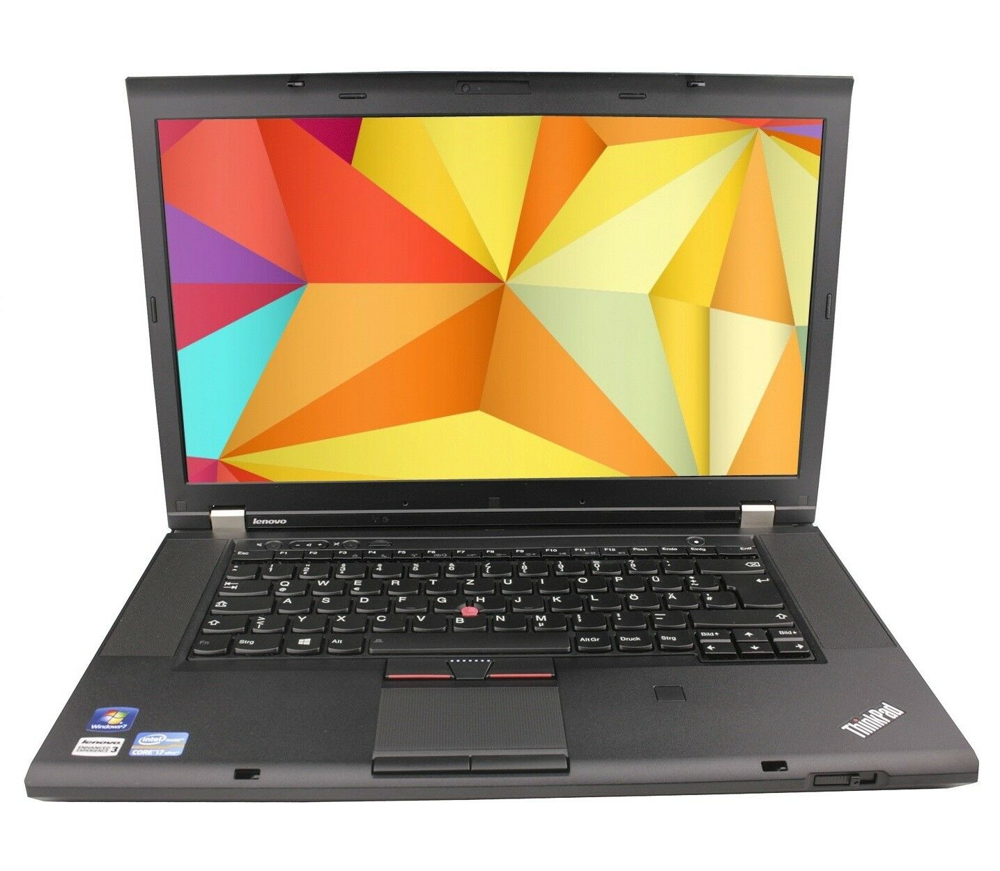
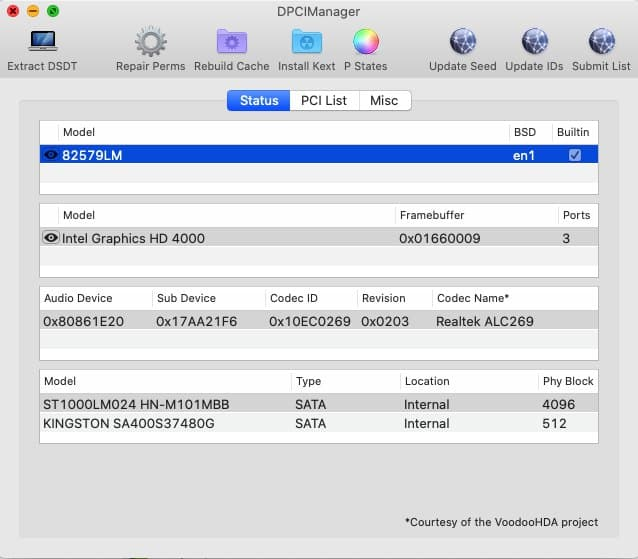
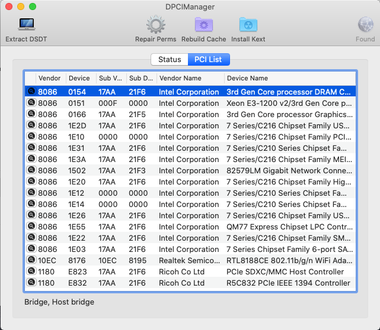

# Lenovo-Thinkpad-W530-Hackintosh

# Computer Spec:

| Component        | Brank                              |
| ---------------- | ---------------------------------- |
| CPU              | I7 3520M                           |
| iGPU             | Intel® Graphics HD 4000            |
| Display          | 1920x1080p                         |
| Audio            | Realtek ALC269                     |
| Ram              | 16Gb ddr3 1067 Mhz                 |
| SSD              | Kingston A400 512gb                |
| SmBios           | MacbookPro 10.2                    |
| BootLoader       | OpenCore 0.6.4                     |

- Not working
Wifi, miniDisplay 

## DPCIManager Screenshot

- [Acidanthera](https://github.com/acidanthera) for OpenCore and all the lovely hackintosh work.
- [Apple](https://apple.com) for macOS;
- [daliansky](https://github.com/daliansky)
- [Dortiana](https://github.com/dortania)
- [Hackintoshlifeit](https://github.com/Hackintoshlifeit)
- [mald0n](https://github.com/MaLd0n)
- [rehabman](https://github.com/RehabMan)

# If you need help please contact us on [Telegram](https://t.me/HackintoshLife_it) or [Web](https://www.hackintoshlife.it/)
