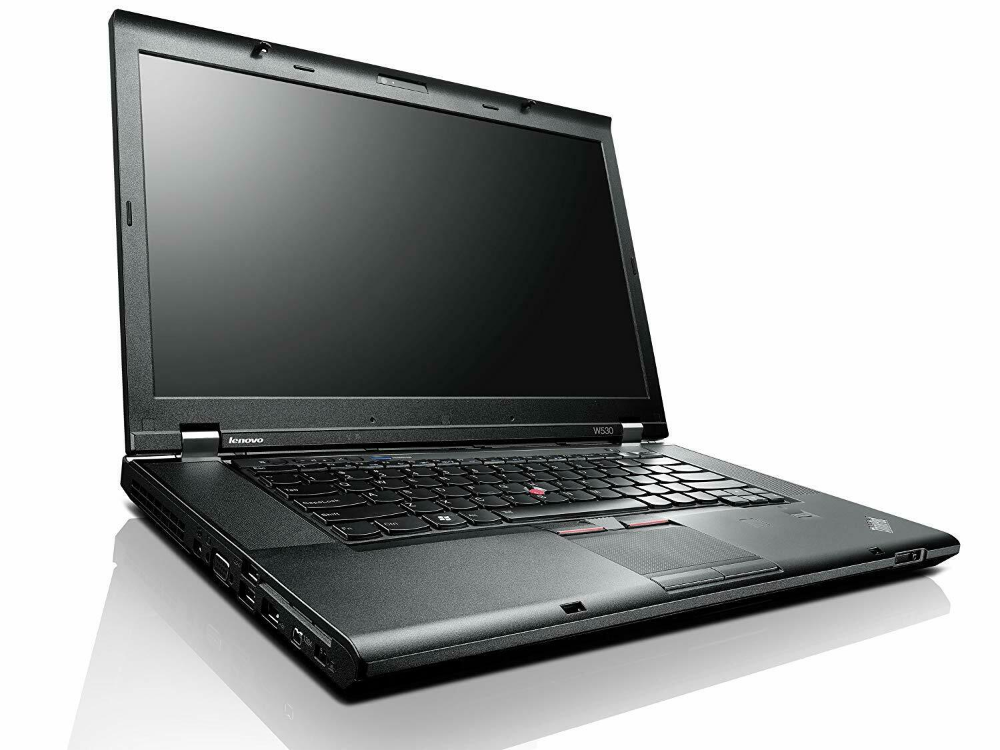

# Lenovo-Thinkpad-W530-Hackintosh

# Computer Spec:

| Component        | Brank                              |
| ---------------- | ---------------------------------- |
| CPU              | I7 3520M                           |
| iGPU             | Intel® Graphics HD 4000            |
| Display          | 1366x768                           |
| Audio            | Realtek ALC270                     |
| Ram              | 8Gb ddr3 1067 Mhz                  |
| SSD              | Kingston A400 512gb                |
| SmBios           | MacbookPro 10.2                    |
| BootLoader       | OpenCore 0.6.4                     |

- Not working
Wifi, miniDisplay 
